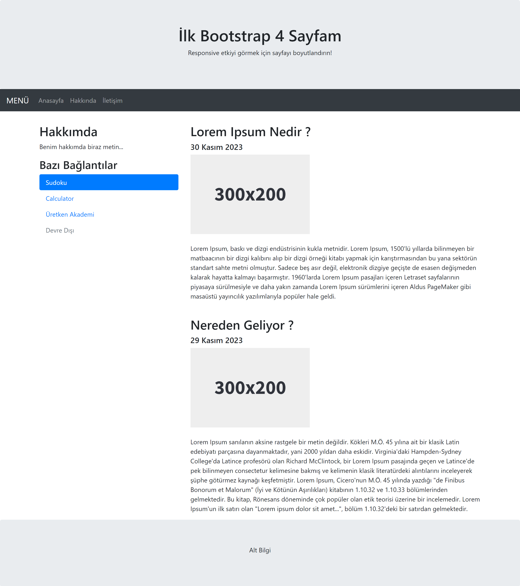

# HTML CSS JavaScript Bootstrap 4 Responsive Website

This project is a simple Responsive website created using basic `HTML`, `CSS`, `JavaScript`, and `Bootstrap 4`.

The project can be viewed live at : [https://ahmetalper0.github.io/bootstrap-4-website/](https://ahmetalper0.github.io/bootstrap-4-website/)

## Screenshots

